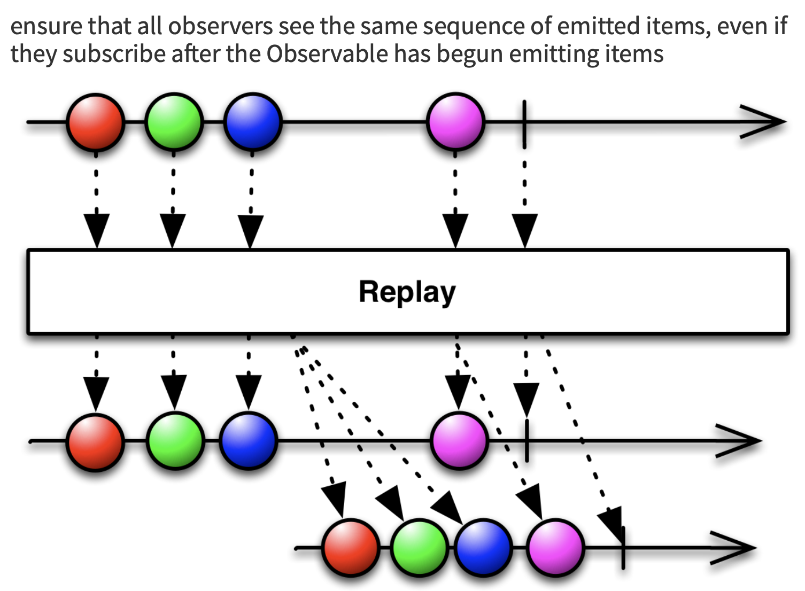

# Start! Rxswift 2주차

> 이번주 주제 : Subject, Relay, Driver와 Signal  

## Subject

- 정의 : 어떤 옵저버블로부터 이벤트를 전달 받아서(옵저버) 자신을 구독하고 있는 옵저버들에게 해당 이벤트를 전달하는 (옵저버블) 객체
  - observable의 특성 : subsciribe() 메소드
  - observer의 특성 : on() 메소드

1. BehaviorSubject

   - 상태값을 가진다. 이 상태값은 subject 생성시 주어지는 인자로 초기화되고,  자신이 마지막으로 내보낸 값으로 바뀐다.

   - 상태값을 value() 메소드로 참조 가능하다.

   - value() 메소드는 BehaviorSubject에 error가 발생했거나 dispose된 경우는 에러를 던진다. 

   - 구독을 할 경우, 자신의 현재 상태 값을 첫번째 이벤트로 내보낸다.

   - next 이벤트가 들어오면, 자신의 상태값을 갱신하고 자신을 구독하고 있는 모든 옵저버들에게 이벤트를 내보낸다.

   - completed나 error 이벤트(이하, 종료 이벤트)가 발생한 경우, 해당 Subject는 종료되고 종료 이벤트가 모든 옵저버에 전달된다.

   - 종료된 Subject에 접근할 경우, 해당 subject가 마지막으로 발생시킨 종료 이벤트를 받게 된다.

     

     

     

     ```swift
     public func on(_ event: Event<Element>) {
             dispatch(self._synchronized_on(event), event) //자신을 구독한 옵저버 리스트와 이벤트를 인자로 받아 리스트의 모든 옵저버에 이벤트를 방출한다.
         }
     
     func _synchronized_on(_ event: Event<Element>) -> Observers {
             self._lock.lock(); defer { self._lock.unlock() }
             if self._stoppedEvent != nil || self._isDisposed {
                 return Observers()
             }
             
             switch event {
             case .next(let element):
                 self._element = element
             case .error, .completed:
                 self._stoppedEvent = event
             }
             
             return self._observers
         }
     
     public override func subscribe<Observer: ObserverType>(_ observer: Observer) -> Disposable where Observer.Element == Element {
             self._lock.lock()
             let subscription = self._synchronized_subscribe(observer)
             self._lock.unlock()
             return subscription
         }
     
     func _synchronized_subscribe<Observer: ObserverType>(_ observer: Observer) -> Disposable where Observer.Element == Element {
             if self._isDisposed {
                 observer.on(.error(RxError.disposed(object: self)))
                 return Disposables.create()
             }
             
             if let stoppedEvent = self._stoppedEvent {
                 observer.on(stoppedEvent)
                 return Disposables.create()
             }
             
             let key = self._observers.insert(observer.on)
             observer.on(.next(self._element))
         
             return SubscriptionDisposable(owner: self, key: key)
         }
     ```

     

2. PublishSubject

   - BehaviorSubject와의 가장 큰 차이점은 상태값이 없다는 것이다.
    
   - 상태값이 없기 때문에, 구독해도 바로 이벤트를 받을 수는 없다.
  
   - next이벤트가 발생하면 자신을 구독하는 모든 옵저버에게 이벤트가 전달된다.
  
   - 종료 이벤트를 받으면, 종료 이벤트를 내보내고 해당 Subject는 종료된다.  더이상의 구독을 유지할 이유가 없기 때문에 현재의 구독을 모두 해지한다.
  
   - 종료된 publishSubject를 구독하면, 마지막으로 발생한 종료 이벤트를 받게 된다.


```swift
//PublishSubject의 on메소드와 subscribe 메소드 
public func on(_ event: Event<Element>) {
        dispatch(self._synchronized_on(event), event)
    }

func _synchronized_on(_ event: Event<Element>) -> Observers {
        self._lock.lock(); defer { self._lock.unlock() }
        switch event {
        case .next:
            if self._isDisposed || self._stopped {
                return Observers()
            }
            
            return self._observers
        case .completed, .error:
            if self._stoppedEvent == nil {
                self._stoppedEvent = event
                self._stopped = true
                let observers = self._observers //구독을 끊기 전, 종료 이벤트를 보내기 위해 구독 정보를 복사한다. (observers 목록은 struct이므로 값이 복사된다)
                self._observers.removeAll() //구독 정보를 모두 지운다.
                return observers
            }

            return Observers()
        }
    }

public override func subscribe<Observer: ObserverType>(_ observer: Observer) -> Disposable where Observer.Element == Element {
        self._lock.lock()
        let subscription = self._synchronized_subscribe(observer)
        self._lock.unlock()
        return subscription
    }

func _synchronized_subscribe<Observer: ObserverType>(_ observer: Observer) -> Disposable where Observer.Element == Element {
        if let stoppedEvent = self._stoppedEvent {
            observer.on(stoppedEvent)
            return Disposables.create()
        }
        
        if self._isDisposed {
            observer.on(.error(RxError.disposed(object: self)))
            return Disposables.create()
        }
        
        let key = self._observers.insert(observer.on)
        return SubscriptionDisposable(owner: self, key: key)
    }
```


3. AsyncSubject
   - completed 되어야만 값이 나온다.
  
   - completed 이전의 next 이벤트에 대해서는 아무것도 내보내지 않는다.

   - 구독해도 subject가 종료 될 때까지는 아무것도 받아볼 수 없다.

   - subject가 종료 이벤트를 발생시킬 때에, 마지막으로 발생된 next이벤트를 방출하고, 종료 이벤트를 뒤 이어 보낸 뒤 모든 구독을 끊는다.
  
   - subject가 값을 내보내고 종료된 후에 구독할 경우, 내보낸 값과 completed이벤트를 받게 된다.
  
   - 만약 값이 없이 그냥 completed된 경우는 값없이 그냥 completed만 받게 되며, error의 경우에는 error를 받게 된다.


```swift
 public func on(_ event: Event<Element>) {
        let (observers, event) = self._synchronized_on(event)
        switch event { // 인자로 받은 이벤트가 아니라 _synchronized_on(event)의 반환값으로 나온 event
        case .next:
            dispatch(observers, event)
            dispatch(observers, .completed)
        case .completed:
            dispatch(observers, event)
        case .error:
            dispatch(observers, event)
        }
    }

func _synchronized_on(_ event: Event<Element>) -> (Observers, Event<Element>) {
        self._lock.lock(); defer { self._lock.unlock() }
        if self._isStopped {
            return (Observers(), .completed)
        }

        switch event {
        case .next(let element):
            self._lastElement = element
            return (Observers(), .completed) //아무에게도 이 이벤트를 전달하지 않는다.
        case .error:
            self._stoppedEvent = event

            let observers = self._observers
            self._observers.removeAll()

            return (observers, event)
        case .completed:

            let observers = self._observers
            self._observers.removeAll()

            if let lastElement = self._lastElement {
                self._stoppedEvent = .next(lastElement)
                return (observers, .next(lastElement))
            }
            else {
                self._stoppedEvent = event
                return (observers, .completed)
            }
        }
    }

public override func subscribe<Observer: ObserverType>(_ observer: Observer) -> Disposable where Observer.Element == Element {
        self._lock.lock(); defer { self._lock.unlock() }
        return self._synchronized_subscribe(observer)
    }

func _synchronized_subscribe<Observer: ObserverType>(_ observer: Observer) -> Disposable where Observer.Element == Element {
        if let stoppedEvent = self._stoppedEvent {
            switch stoppedEvent {
            case .next:
                observer.on(stoppedEvent)
                observer.on(.completed)
            case .completed:
                observer.on(stoppedEvent)
            case .error:
                observer.on(stoppedEvent)
            }
            return Disposables.create()
        }

        let key = self._observers.insert(observer.on)

        return SubscriptionDisposable(owner: self, key: key)
    }
```

4. ReplaySubject
   - 특정 횟수만큼의 과거 이벤트를 저장하고 있는 BehaviorSubject라 생각하면 된다.
  
   - 내부에 큐를 가지고 있고, next 이벤트가 발생할 때마다 해당 큐에 값이 들어가고, 정해진 갯수를 넘을 경우 큐에서 값들을 제거한다.
  
   - 새로 구독을  할 때, 오래된 값부터 최근 값까지 정해진 수 만큼 이벤트를 연속적으로 받게 된다.

   - subject가 종료될 경우, 종료 이벤트를 보낸 후에, 모든 subscribe를 해제한다.

   - subject가 종료된 이후에 subscribe가 들어올 경우, 가지고 있던 값들을 모두 이벤트로 발생 시킨 후, 종료 이벤트를 내보낸다.

   - 다른 subject와 다르게, ReplaySubject는 추상 클래스이고, 서브클래스들도 모두 private class이기 때문에 직접 인스턴스를 만들 수 없다.

   - create()라는 팩토리 메소드를 통해 인스턴스를 만들어서 사용한다.


```swift
override func on(_ event: Event<Element>) {
    dispatch(self._synchronized_on(event), event)
}

func _synchronized_on(_ event: Event<Element>) -> Observers {
    self._lock.lock(); defer { self._lock.unlock() }
    if self._isDisposed {
      return Observers()
    }

    if self._isStopped {
      return Observers()
    }

    switch event {
      case .next(let element):
        self.addValueToBuffer(element) // 현재의 이벤트를 저장한다.
        self.trim() // 정해진 갯수를 넘어갈 경우 오래된 이벤트부터 버퍼에서 제거한다.
        return self._observers
      case .error, .completed:
        self._stoppedEvent = event
        self.trim()
        let observers = self._observers
        self._observers.removeAll()
        return observers
    }
}

override func subscribe<Observer: ObserverType>(_ observer: Observer) -> Disposable where Observer.Element == Element {
    self._lock.lock()
    let subscription = self._synchronized_subscribe(observer)
    self._lock.unlock()
    return subscription
}

func _synchronized_subscribe<Observer: ObserverType>(_ observer: Observer) -> Disposable where Observer.Element == Element {
  if self._isDisposed {
    observer.on(.error(RxError.disposed(object: self)))
    return Disposables.create()
  }

  let anyObserver = observer.asObserver()

  self.replayBuffer(anyObserver) //이전에 발생했던 이벤트들을 지금 구독을 한 옵저버에게 보낸다.
  if let stoppedEvent = self._stoppedEvent {
    observer.on(stoppedEvent)
    return Disposables.create()
  }
  else {
    let key = self._observers.insert(observer.on)
    return SubscriptionDisposable(owner: self, key: key)
  }
}
```


------

## Relay 

- 기존의 Variable을 대체하는 개념(정확히는 Variable은 BehaviorRelay로 대체되었고, PublishRelay는 새로 추가 된 것이다.)

- RxRelay패키지에 정의되어 있다.

- Subject의 Wrapper 클래스이다.

- 절대로 completed되지 않고, error를 방출하지도 않는다.

- 옵저버의 역할을 제한적으로 수행한다. on 메소드가 없고,  accept 함수를 통해 Relay에 **값**을 집어넣으면, 구독하는 옵저버들에게 next이벤트로 바뀌어 자동으로 방출된다.

- 종류
  - PublishRelay(PublishSubject의 Wrapper) 
  - BehaviorRelay(BehaviorRelay의 Wrapper)

>  옵저버블에  릴레이를 bind해도 될까?
>
> 우선 Rxrealy에는 ObservableType의 extension으로 bind 메소드가 정의되어 있다.
>
> ```swift
> //PublishRelay에 대한 bind 메소드. BehaviorRelay도 타입 빼고 같은 내용의 메소드가 있다.
> public func bind(to relays: PublishRelay<Element>...) -> Disposable {
>         return bind(to: relays)
>     }
> 
>   private func bind(to relays: [PublishRelay<Element>]) -> Disposable {
>         return subscribe { e in
>             switch e {
>             case let .next(element):
>                 relays.forEach {
>                     $0.accept(element) // Relay 내부의 Subject에 next이벤트를 흘려보낸다.
>                 }
>             case let .error(error):
>               	//디버그 모드면 런타임 에러를, 릴리즈 모드면 그냥 에러 메시지를 print만 한다.
>               	//즉, 어떻게 해서든 내부 subject에 에러가 흘러가지를 않는다.
>                 rxFatalErrorInDebug("Binding error to publish relay: \(error)")
>             case .completed:
>                 break
>             }
>         }
>     }
> ```
>
> 즉, error나 completed를 무시하도록 되어 있다. 바인드된 옵저버블이 종료되어도 Relay가 가지고 있는 Subject는 종료되지 않기 때문에 상태 불일치가 발생한다. 소스 옵저버블이 절대로 종료되지 않는다는 것이 보장 되지 않는 이상 Relay를 bind시키는 것은 바람직하지 않다. 

------

## Driver와 Signal

- 디른 Rx구현체에는 없고 RxSwift에만 있다.

- RxCocoa 프레임워크에 정의되어 있다.

- 절대 종료되지 않는다.(error나 completed 되지 않는다.) 
  - 원본 옵져버블이 종료될 경우 이후에는 지정된 값만을 내보낸다.

> 옵저버블의 공유
>
> 새로운 옵저버가 옵저버블을 구독할 때마다 새로운 스트림이 생겨난다. 사이드 이펙트(Side-effect)가 없고 짦은 시간 동작하고 사라질 스트림이라면 상관 없지만, 사이드 이펙트가 있거나 긴 시간 동작하면서 메모리에 상주하거나 아예 종료되지 않는 것이라면 필연적으로 메모리 문제가 생긴다. 이러한 문제를 해결하기 위해서 하나의 스트림의 값을 공유하는 방법이 필요한데 크게 두가지 방법이 있다. 하나는 Subject, 다른 하나는 share 오퍼레이터를 사용하는 것이다.(본래 Rx에서는 Replay)
>
> ```swift
> public func share(replay: Int = 0, scope: SubjectLifetimeScope = .forever | .whileConnected)//replay: 구독시에 받을 과거 이벤트의 수, SubjectLifetimeScope: share된 옵저버블의 수명 
> ```
>
> 
>
> 이를 설명한 이유는 Driver와 Signal이 바로 이 share로 만들어진 것들이기 때문이다.
>
> ```swift
> source.share(replay: 1, scope: .whileConnected) // driver의 핵심 선언부
> source.share(replay: 0, scope: .whileConnected) // signal의 핵심 선언부
> ```

- 내부적으로 observeOn(MainScheduler) 를 호출해서 무조건 MainScheduler에서 돌아가고, 실제로도 MainScheduler에서 동작하는 것을 전제로 사용해야 한다. observeOn으로 동작 Scheduler를 옮길수는 있지만 권장되지 않는다.

- 구독을 할 때에도 MainScheduler에서 하는 것이 권장된다.

  - Signal은 괜찮지만, Driver를  MainScheduler가 아닌 다른 Scheduler에서 하게 되면 구독할 때 방출되는 이벤트가 MainScheduler가 아닌 Scheduler에서 작동하게 되면서 오류가 발생할 수 있다.

- 그 외에도 다음과 같은 차이를 가진다.

  |                                       | Driver  | Signal |
  | :-----------------------------------: | :-----: | :----: |
  |              구독 메소드              | drive() |  emit()  |
  | 구독시 가장 최근 이벤트를 받는지 여부 |    O    |   X    |

> 일반 옵져버블도 Driver나 Signal로 변환해줄 수 있다.
>```swift
>// asDriver의 함수 정의 중 하나, Signal도 이와 비슷하다.
>public func asDriver(onErrorJustReturn: Element) -> Driver<Element> {
>        let source = self
>            .asObservable()
>            .observeOn(DriverSharingStrategy.scheduler) // MainScheduler를 나타낸다.
>            .catchErrorJustReturn(onErrorJustReturn) // error나 completed가 된 경우 대신 내보낼 값. 
>        return Driver(source)
>```
>여기서 Driver와 Signal의 특징인 
>   1. MainScheduler에서 동작한다.
>   2. error나 Completed가 발생하지 않는다.  
>가 명확하게 드러난다.
